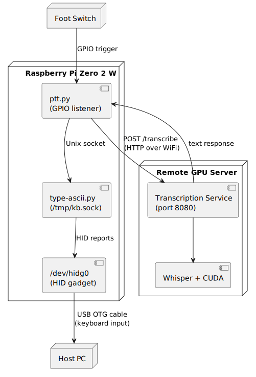

# Raspberry Pi Voice Keyboard

A speech-to-text transcription system using Whisper with NVIDIA GPU acceleration, designed to reduce hand strain from extended typing.
Uses via Raspberry Pi Zero 2 W as a USB HID gadget.

## Features

- **GPU-accelerated transcription** - 0.02x-0.19x realtime with medium.en Whisper model using NVIDIA CUDA (essentially instantaneous)
- **Raspberry Pi integration** - Types transcribed text as a USB keyboard, no-fuss compatibility
- **Simple dictation interface** - Bind a keyboard shortcut for hands-free operation
- **Production ready** - In daily use by author

### Prerequisites

- NVIDIA GPU with CUDA support
- Raspberry Pi Zero W (for USB HID keyboard gadget)
- A micro-USB OTG cable
- Ubuntu-based Linux (for the `nvidia-cuda-toolkit` multiverse package)

Non-Ubuntu systems can be *theoretically* be used, through alternative drivers directly from NVIDIA.

### Basic Setup

On the GPU-bearing Linux host:

1. `sudo apt install nvidia-cuda-toolkit`
2. `./build-whisper-cuda.sh`
3. Download a Whisper model using `./download-model.sh`
4. Set up Raspberry Pi as USB keyboard
5. Configure producer scripts for recording dictation

See [CLAUDE.md](CLAUDE.md) for detailed instructions.

## Architecture

- **service/** - Go HTTP service for GPU-accelerated transcription
- **producer/** - Client scripts for audio capture and dictation
- **consumer/** - Raspberry Pi scripts for USB keyboard emulation
- **whisper.cpp/** - Whisper inference library (cloned from upstream)

### Push-to-Talk Sequence

## Documentation

- [CLAUDE.md](CLAUDE.md) - Complete setup and usage guide
- [consumer/README.md](consumer/README.md) - Raspberry Pi setup documentation
- [producer/README.md](producer/README.md) - Producer scripts documentation

## License

See [LICENSE](LICENSE)
